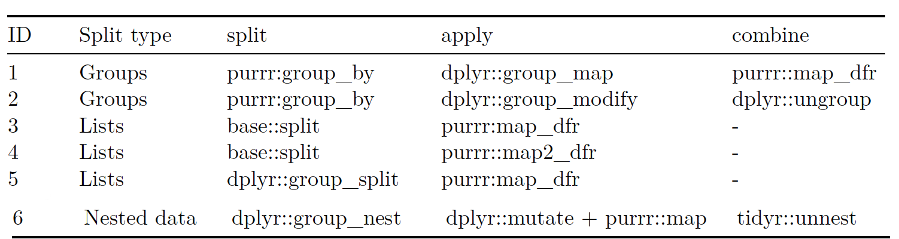

```{r, include=FALSE}
## By default, show code for all chunks in the knitted document,
## as well as the output. To override for a particular chunk
## use echo = FALSE in its options.
knitr::opts_chunk$set(
   echo=TRUE, message=FALSE, warning=FALSE
)
```

```{r, echo=FALSE}
# CONFIG
user_name <- "fernandomillanvillalobos" # your Git username (only needed if
# you want to deploy to GH pages)
project_name <- "r-statistics" # adapt!
package_date <- "2022-10-01" # date of the CRAN snapshot that
# the checkpoint package uses
r_version <- "4.2.1" # R-Version to use
options(Ncpus = 4) # use 4 cores for parallelized installation of packages
if (r_version != paste0(version$major, ".", version$minor)) {
  stop("ERROR: specified R version does not match currently used.")
}
```

# Notes

This report was generated on `r Sys.time()`. R version: `r paste0(version$major, ".", version$minor)` on `r version$platform`. For this report, CRAN packages as of `r package_date` were used.

...

## R-Script & data

The preprocessing and analysis of the data was conducted in the [R project for statistical computing](https://www.r-project.org/). The RMarkdown script used to generate this document and all the resulting data can be downloaded [under this link](http://`r user_name`.github.io/`r project_name`/). Through executing `main.Rmd`, the herein described process can be reproduced and this document can be generated. In the course of this, data from the folder `input` will be processed and results will be written to `output`. The html on-line version of the analysis can be accessed through this [link](https://`r user_name`.github.io/`r project_name`/). 

## GitHub

The code for the herein described process can also be freely downloaded from [https://github.com/`r user_name`/`r project_name`](https://github.com/`r user_name`/`r project_name`). 

## License

...

## Data description of output files

#### `abc.csv` (Example)

| Attribute | Type | Description |
|-------|------|-----------------------------------------------------------------------------|
| a | Numeric | ... |
| b | Numeric | ... |
| c | Numeric |  ... |

...

# Set up

```{r, echo=FALSE}
detach_all_packages <- function() {
  basic_packages_blank <-  c("stats",
                             "graphics",
                             "grDevices",
                             "utils",
                             "datasets",
                             "methods",
                             "base")
  basic_packages <- paste("package:", basic_packages_blank, sep = "")

  package_list <- search()[
    ifelse(unlist(gregexpr("package:", search())) == 1, TRUE, FALSE)]

  package_list <- setdiff(package_list, basic_packages)

  if (length(package_list) > 0)  for (package in package_list) {
    detach(package, character.only = TRUE, unload = TRUE)
    print(paste("package ", package, " detached", sep = ""))
  }
}

detach_all_packages()

# this allows multiple persons to use the same RMarkdown
# without adjusting the working directory by themselves all the time
source("scripts/csf.R")
path_to_wd <- csf() # if this - for some reason - does not work,
# replace with a hardcoded path, like so: "~/projects/rddj-template/analysis/"
if (is.null(path_to_wd) | !dir.exists(path_to_wd)) {
  print("WARNING: No working directory specified for current user")
} else {
  setwd(path_to_wd)
}

# suppress scientific notation
options(scipen = 999)

# suppress summarise info
options(dplyr.summarise.inform = FALSE)

# unload global rstudioapi and knitr again to avoid conflicts with checkpoint
# this is only necessary if executed within RStudio
# outside of RStudio, namely in the knit.sh script, this causes RMarkdown
# rendering to fail, thus should not be executed there
if (Sys.getenv("RSTUDIO") == "1") {
  detach_all_packages()
}
```

## Define packages

```{r, echo=TRUE, message=FALSE, warning=FALSE}
# from https://mran.revolutionanalytics.com/web/packages/\
# checkpoint/vignettes/using-checkpoint-with-knitr.html
# if you don't need a package, remove it from here (commenting not sufficient)
# tidyverse: see https://blog.rstudio.org/2016/09/15/tidyverse-1-0-0/
cat("
library(rstudioapi)
library(tidyverse)
library(tidylog)
library(jsonlite)
library(lintr)
library(rmarkdown)
library(rio)
library(cowplot)
library(extrafont)
library(ggrepel)
library(scales)
library(gapminder)
library(broom)
library(janitor)",
file = "manifest.R")
```

## Install packages

```{r, echo=TRUE, message=FALSE, warning=FALSE}
# if checkpoint is not yet installed, install it (for people using this
# system for the first time)
if (!require(checkpoint)) {
  if (!require(devtools)) {
    install.packages("devtools", repos = "http://cran.us.r-project.org")
    require(devtools)
  }
  devtools::install_github("RevolutionAnalytics/checkpoint",
                           ref = "v0.3.2", # could be adapted later,
                           # as of now (beginning of July 2017
                           # this is the current release on CRAN)
                           repos = "http://cran.us.r-project.org")
  require(checkpoint)
}
# nolint start
if (!dir.exists("~/.checkpoint")) {
  dir.create("~/.checkpoint")
}
# nolint end
# install packages for the specified CRAN snapshot date
checkpoint(snapshot_date = package_date,
           project = path_to_wd,
           verbose = T,
           scanForPackages = T,
           use.knitr = F,
           R.version = r_version)
rm(package_date)
```

## Load packages

```{r, echo=TRUE, message=FALSE, warning=FALSE}
source("manifest.R")
unlink("manifest.R")
sessionInfo()
```

## Load additional scripts

```{r, echo=TRUE, message=FALSE, warning=FALSE}
# if you want to outsource logic to other script files, see README for 
# further information
# Load all visualizations functions as separate scripts
knitr::read_chunk("scripts/dviz.supp.R")
source("scripts/dviz.supp.R")
knitr::read_chunk("scripts/themes.R")
source("scripts/themes.R")
knitr::read_chunk("scripts/plot_grid.R")
source("scripts/plot_grid.R")
knitr::read_chunk("scripts/align_legend.R")
source("scripts/align_legend.R")
knitr::read_chunk("scripts/label_log10.R")
source("scripts/label_log10.R")
knitr::read_chunk("scripts/outliers.R")
source("scripts/outliers.R")
knitr::read_chunk("scripts/api-keys.R")
source("scripts/api-keys.R")
```

# Inferential Statistics

## Linear regression

To perform further analysis with the parameters of our model, we can pipe the model into the tidy function from the __broom__ package. To apply the same model to each variable (e.g. country) is to use the `split > apply > combine` technique. The combination of `group_by` and `summarise` is a method of `split > apply > combine`. Another method for `slice > apply > combine` is to use `group_by` with `slice_max`, and `ungroup`. `\(.x)` is a shorthand option for an anonymous function in R. It was introduced with R 4.1.0. There is not just one way to run many models with the Tidyverse, but many.



First of all, we can differentiate between the three split types:

- _group_: When we talk about groups, we mean that the data is in the form of a grouped tibble.
- _lists_: By lists we mean the native list data type 
- _nested_data_: By nested data, we mean nested data frames in which columns of a data frame contain lists or data frames.

Some methods combine the `apply > combine` step into one function (`split > map_dfr` and `split -> map2_dfr`). All methods have in common that a data frame comes in and a data frame goes out. What kind of data frame is returned depends on what we do in the apply phase. In our case, we chose to output the test statistics or parameters of our models. Similarly, we could also output the predictions of our models.

`group_map` function takes a grouped tibble as input and outputs a list. Before this function, we could not simply iterate a function over groups in a grouped tibble. Instead, we split data frames into a list and applied __purrr__ functions to the elements of that list (e.g., map). If you like, `group_map` is the __dplyr__ version of __purrr’s__ `map` functions.

Compared to `group_map`, this function also accepts a grouped tibble, but outputs a grouped tibble instead of a list. With `group_modify` you have to make sure that a data frame is returned, otherwise the function will yield an error. The great advantage of this method is that we can other the country and continent as columns. The beauty of keeping the country and continent columns is that we can now compare the fit of our model to the actual life expectancies in these countries. To get this data, we can use the `augment` function from the __broom__ package. For each country, the function returns the fitted values of our dependent variable (in our case life expectancy), the residuals and the actual values of the dependent variable.

The combination of `group_split` and `map_dfr` is just an alternative version of `split` and `map_dfr`. `group_split` was introduced in __dplyr__ for version 0.8.0 in 2019. It is still in an experimental state. The difference with `split` is that `group_split` does not name the elements of the returned list.

The `group_nest` function was also introduced with the __dplyr__ version 0.8.0 and works pretty similar to nest. Compared to `nest`, with `group_nest` you name the columns that should not be nested instead of the columns that should be nested.

```{r}
# plotting the development of life expectancy 
ggplot(
  gapminder,
  aes(x = year, y = lifeExp, group = country)
) +
  geom_line(alpha = .3)

ggplot(
  gapminder,
  aes(x = year, y = lifeExp, group = country)
) +
  geom_line(alpha = .3) +
  facet_wrap(vars(continent))

# building a linear model
model <- lm(lifeExp ~ year, data = gapminder)
summary(model)

# further analysis using the data extracted from the linear model
model %>% 
  tidy()

# getting the test statistics of our model
model %>% 
  broom::glance()

# calculating the mean per continent and year
(group_by_summarise_example <- gapminder %>%
  group_by(continent, year) %>%
  summarise(mean = mean(lifeExp, na.rm = TRUE)) %>%
  ungroup())

# plotting the results
group_by_summarise_example %>%
  ggplot(aes(x = year, y = mean)) +
  geom_line(aes(color = continent))

# finding for each continent the year in which life expectancy was highest over the last 50 years
(group_by_with_slice_max <- gapminder %>%
  group_by(continent) %>%
  slice_max(lifeExp, n = 1) %>%
  ungroup())

# running the same linear model for each country
(test_statistics <- gapminder %>%
  split(.$country) %>% # split the data frame into a list. Each list element contains a data frame of one country
  map_dfr(\(.x) lm(lifeExp ~ year, .x) %>% # loop over the data frame of each country -> apply two functions at once: map_dfr() and lm()
    broom::glance())) # extract the test statistics from the model object

# looking at the adjusted R-squared
test_statistics %>%
  ggplot(aes(x = adj.r.squared)) +
  geom_histogram(binwidth = .1, fill = "grey80", color = "gray20")

#  ways to run many models with the Tidyverse
# using grouped data with group_map()
gapminder %>%
  group_by(country) %>%
  group_map(
    .data = .,
    .f = ~ lm(lifeExp ~ year, data = .) %>% glance()
  ) %>% # get the test statistics
  map_dfr(~.) # combine the list of a data frames obtained in one data frame

# using grouped data with group_modify()
(method_two_results <- gapminder %>%
  group_by(country, continent) %>%
  group_modify(
    .data = .,
    .f = ~ lm(lifeExp ~ year, data = .) %>% glance()
  ) %>%
  ungroup())

# plotting the results
method_two_results %>%
  ggplot(aes(x = adj.r.squared)) +
  geom_histogram(binwidth = .1, fill = "grey80", color = "gray20") +
  facet_wrap(vars(continent))

# showing the countries with the worst fit
method_two_results %>%
  slice_min(adj.r.squared, n = 5)


# comparing the fit of our model to the actual life expectancies in these countries
(augmented_data <- gapminder %>%
  group_by(country, continent) %>%
  group_modify(
    .data = .,
    .f = ~ lm(lifeExp ~ year, data = .) %>% augment()
  ) %>%
  ungroup())

# comparing our regression models for the bottom five countries with the actual data
augmented_data %>%
  filter(country %in% (
    method_two_results %>% slice_min(adj.r.squared, n = 5) %>%
      pull(country)
  )) %>%
  ggplot(aes(x = year, y = .fitted)) +
  geom_line() +
  geom_line(aes(y = .fitted + .resid), color = "blue") +
  facet_wrap(vars(country))

# the top five countries
augmented_data %>%
  filter(country %in% (
    method_two_results %>% slice_max(adj.r.squared, n = 5) %>%
      pull(country)
  )) %>%
  ggplot(aes(x = year, y = .fitted)) +
  geom_line() +
  geom_line(aes(y = .fitted + .resid), color = "blue") +
  facet_wrap(vars(country))

# using split and map_dfr but keeping countries and continent
gapminder %>%
  split(.$country) %>%
  map_dfr(
    .x = .,
    .f = ~ lm(lifeExp ~ year, data = .x) %>%
      tidy() %>%
      mutate(
        country = .x$country[1],
        continent = .x$continent[1]
      )
  )

# using group_split() instead of split()
gapminder %>%
  group_split(country) %>%
  map_dfr(
    .x = .,
    .f = ~ lm(lifeExp ~ year, data = .x) %>%
      tidy() %>%
      mutate(
        country = .x$country[1],
        continent = .x$continent[1]
      )
  )

# using group_nest()
gapminder %>%
  group_nest(continent, country) %>%
  mutate(
    model = map(data, ~ lm(lifeExp ~ year, data = .) %>%
      tidy())
  ) %>%
  select(-data) %>%
  unnest(model)
```
# Linting

The code in this RMarkdown is linted with the [lintr package](https://github.com/jimhester/lintr), which is based on the  [tidyverse style guide](http://style.tidyverse.org/). 

```{r echo=TRUE, message=FALSE, warning=FALSE, results='hide'}
# lintr::lint("main.Rmd", linters =
#               lintr::with_defaults(
#                 commented_code_linter = NULL,
#                 trailing_whitespace_linter = NULL
#                 )
#             )
# if you have additional scripts and want them to be linted too, add them here
# lintr::lint("scripts/my_script.R")
```
